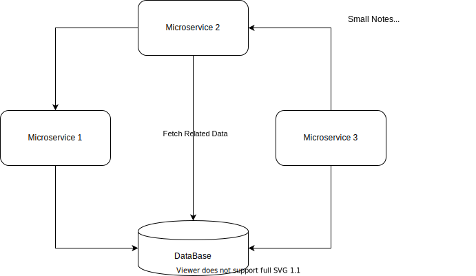

# REASON TO EMBED DIAGRAM IN README.md 

Documentation and service description it is a big thing, 
Using Diagrams helps to become familiar with a service much faster

It could be hard task to create good and easy to catch diagrams, BUT much more hard thing keep it UP-TO-DATE.
Common approach is using of Atlassian __*Confluence*__ Service.
It looks convenient from first sight, but could leads to structure hard for support.
In this case possible daily coding routines look next way:

1. Clone github repository to learn/research a code.
2. Find documentation/service description in __*Confluence*__
3. Make some changes in a code using ____*VSCode*____
4. Download diagram sources or acces it by links
5. Make some changes in a documentation using a __*web browser*__
6. Make some changes in a diagrams using a __*web browser*__ or other tool
7. Store changed versions of documentation and store it in temporary source
8. Commit changes into git
9. Make PR and in a description provide a link to updated version of documentation
10. Wait for PR comments
11. Update related code in __*VSCode*__, 
12. Update documentation in __*Confluence*__
13. Wait for PR approvement
14. After approvement publish updates in the documentation
    - Special thing is detect and resolve conflicts in the documentation if someone else made changes in the same time

It means developer have to interact With __*Web browser*__, __*VSCode*__, __*Confluence*__, and __*Diagram Drawing Tool*__

When diagrams and documentation embedded in git repository, if Draw.io plugin is installed to VSCode

1. Clone github repository to learn/research a code and a documentation.
2. Open code and documentation in __*VSCode*__
3. Make changes in a code and in a Diagrams/Documentation in __*VSCode*__
4. Commit it to Github
5. Make PR
6. Wait for PR approvement
7. Update related code, update documentation in __*VSCode*__
8. Wait for PR approvement
    - After approvement Documentation and Diagrams will be UP-TO-DATE

In this scenario __*VSCode*__ - only tool for all steps

# SETUP

Install plugins
- [Draw.io Integration](https://marketplace.visualstudio.com/items?itemName=hediet.vscode-drawio) 
- [Markdown Preview Github Styling](https://marketplace.visualstudio.com/items?itemName=bierner.markdown-preview-github-styles) *Optional*

# HOW TO

## CREATE NEW DIAGRAM
 - Just create new file *.drawio.svg
 - Click on it Explorer sidebar - Draw.io extension should shows to you Draw.io UI

## REPLACE ONE RECTANGLE WITH OTHER SHAPE OR VICE VERSA

- Put new shape on the canvas
- Change necessary properties to stylize
- Click Right on Shape and in pop menu select "Edit style..."
- Copy all style params from TextArea
- Click Right on target shape and in pop menu select "Edit style..."
- Paste style params from clipboard to TextArea

##HOW TO EMBED DIAGRAMS IN README FILE

- All the same as with regular SVG file 

# WHAT ABOUT Sublime AND WebStorm ?
Unfortunately, I found nothing about, how to use draw.io with Sublime or WebStorm. ;(
But, You can download desktop app for Windows, macOS, Linux or even for Google Chrome OS, but more convenient to use with __*VSCode*__ ;)
- [Draw.io Desktop Apps releases](https://github.com/jgraph/drawio-desktop/releases)
